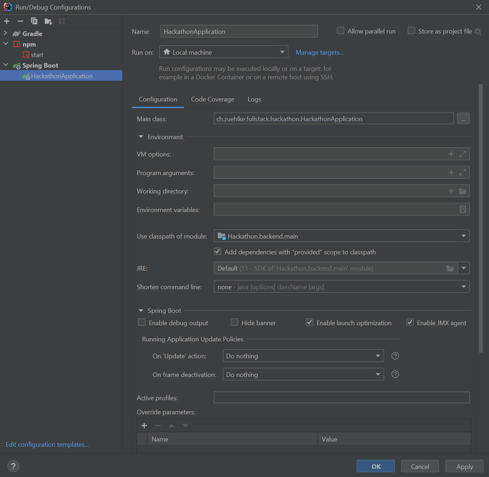
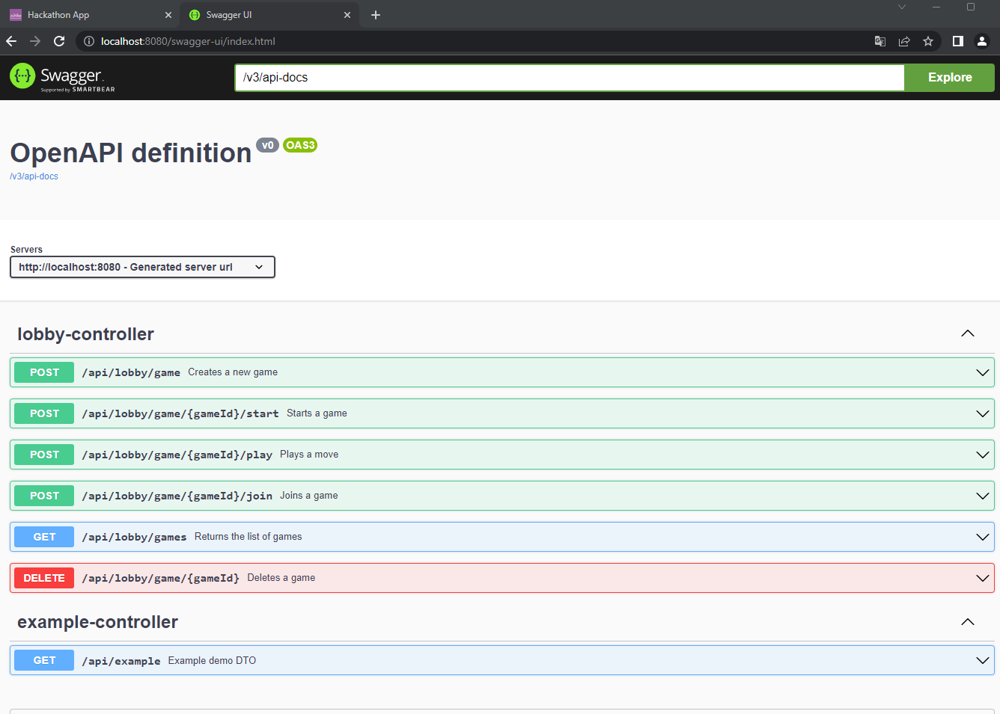
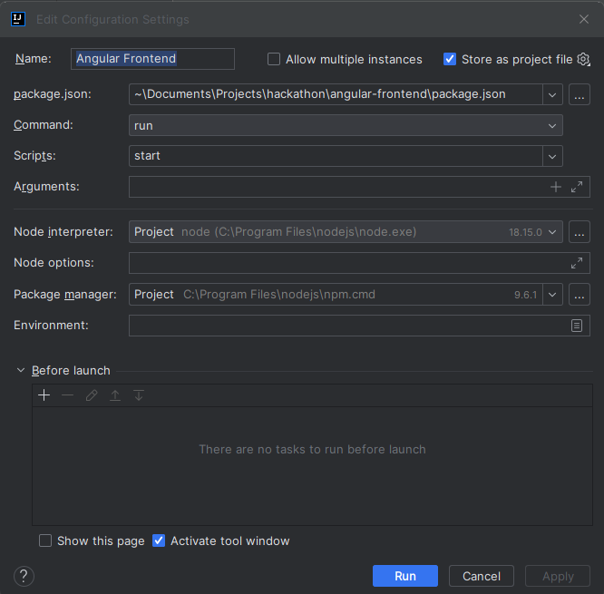
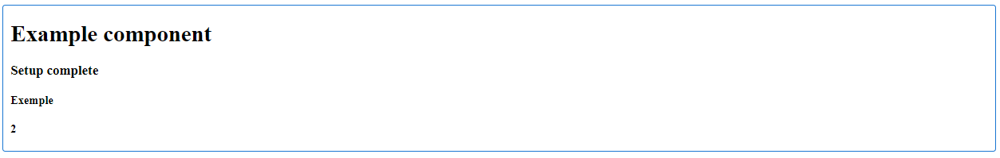
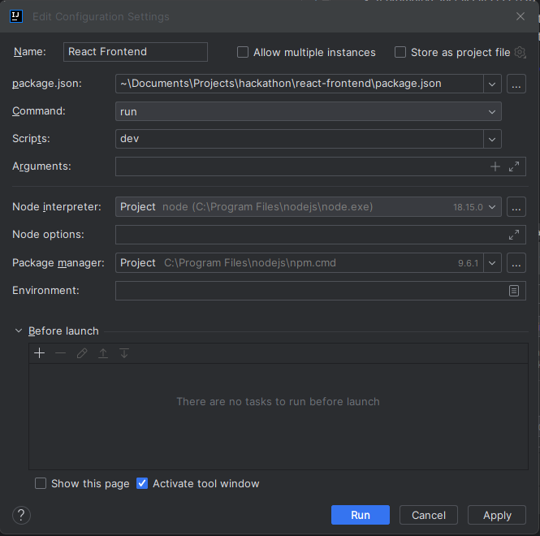
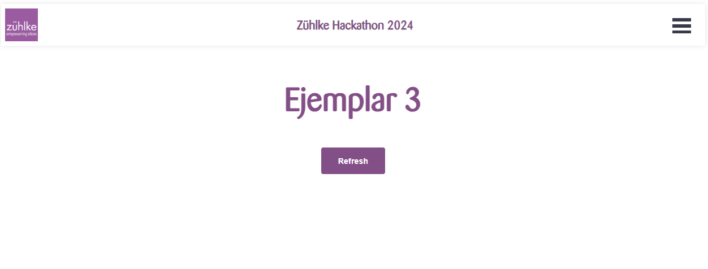

# Java Fullstack Hackathon 2024

---

The project is split into four folders

- java-backend
- dotnet-backend
- react-frontend
- angular-frontend

You should be able to combine both backends with any of the frontends interchangeably. \
You will decide with your team which technologies to use.

## Setup

If your setup already has some of the required tools installed, please adjust accordingly.

1. Both frontends need Node to run. Install newest Node from here https://nodejs.org/en/ (currently 18.15.0 LTS)
2. Run `npm install -g npm@9.6.1`
3. Run `npm install -g @angular/cli@15.2.2`
4. Verify your versions with `ng version`:  
   Angular CLI: **15.2.2** \
   Node: **18.15.0** \
   Package Manager: npm **9.6.1**
4. Install a new version of IntelliJ or VSCode
5. Clone the master branch with `git clone https://github.com/Cyberdog52/hackathon.git`
6. Open the project with IntelliJ and let gradle build the project
7. If prompted, install java (17.0.5). Skip this step if you don't intend to work with java during the hackathon.
8. Install the npm dependencies with `cd angular-frontend` followed by `npm install`
9. Install the npm dependencies with `cd react-frontend` followed by `npm install`

During the hackathon your team can decide to use a custom branch on this GitHub repository or to fork it to your own
private repository.

## Run

### Start java backend

1. Start the java backend either by
    1. By selecting the `Java Backend` run configuration and running it
       
    2. Or by executing `./gradlew bootRun`

You should be able to open the Swagger endpoint documentation at `http://localhost:8080/swagger-ui/index.html`.


### Start dotnet backend
You should be able to open the Swagger endpoint documentation at `http://localhost:8080/swagger/index.html`.

1. make sure that you have all the prerequisites installed
2. Start the dotnet backend either by
   1. Clicking on the green play button `HackathonWebApi`

      
   2. Or by using dotnet commands
   ```powershell
      > cd hackathon\dotnet-backend\HackathonWebApi
      > dotnet restore
      > dotnet clean
      > dotnet run
   ```

### Start Angular frontend

1. By selecting the `Angular Frontend` and running it
   
2. Or by executing `cd angular-frontend` followed by `npm start`

You should now be able to open `http://localhost:4200` to access the frontend.

Now you should see the following screen:


### Start React frontend

1. By selecting the `React Frontend` and running it
   
2. Or by executing `cd react-frontend` followed by `npm run dev`

You should now be able to open `http://localhost:5137` to access the frontend.

Now you should see the following screen:

