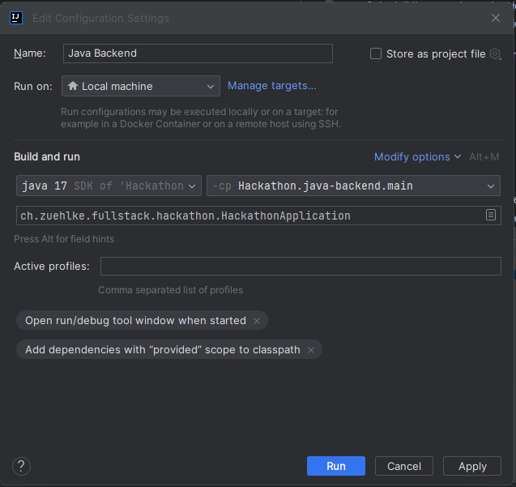

# Java Fullstack Hackathon 2021

---
## Setup

If your setup already has some of the required tools installed, please adjust accordingly.
1. Install Node 12.14.0 from here https://nodejs.org/en/blog/release/v12.14.0/
2. Run `npm install -g @angular/cli@12.2.4`
3. Verify your versions with `ng version`:  
   Angular CLI: **12.2.4**  
   Node: **12.14.0**  
   Package Manager: **npm 7.22.0**  
4. Install a new version of IntelliJ
5. Clone the master branch with `git clone https://github.com/Cyberdog52/hackathon.git`
6. Open the project with IntelliJ and let gradle build the project
7. Install the npm dependencies with `cd frontend` followed by `npm install`

During the hackathon your team can decide to use a custom branch on this GitHub repository or to fork it to your own private repository.

## Run

### Start backend
1. Either by executing `./gradlew bootRun`
2. or by creating a run configuration of type SpringBoot pointing to *ch.zuehlke.fullstack.hackathon.HackathonApplication*

You should be able to open the Swagger endpoint documentation at `http://localhost:8080/swagger-ui.html`.

### Start frontend
1. By executing `cd frontend` followed by `npm start`
2. Or by creating a run configuration of type **npm** pointing to *hackathon\frontend\package.json* with the script **start**

You should now be able to open `http://localhost:4200` to access the frontend.

## Insight API

TODO

## Other API ideas

TODO