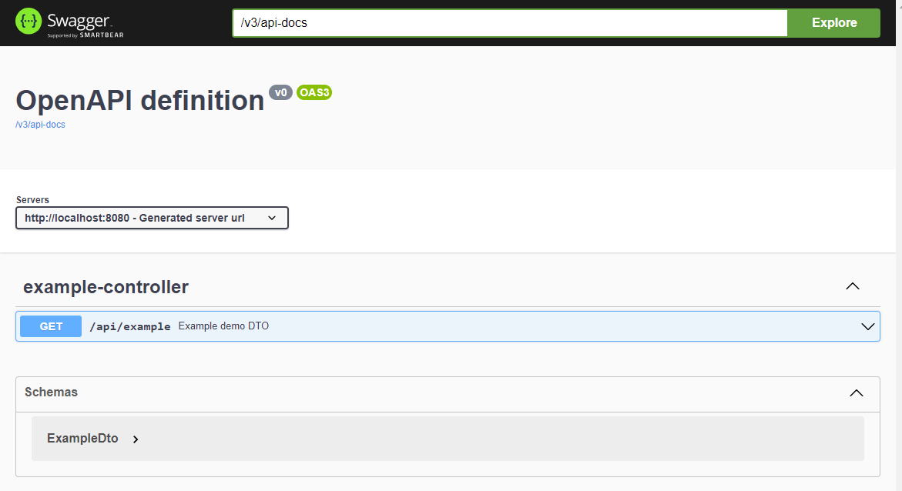

# Java Fullstack Hackathon 2023

## Topic: Zühlke Coding Challenge

---

## Setup

If your setup already has some of the required tools installed, please adjust accordingly.

1. Install newest Node from here https://nodejs.org/en/ (currently 18.15.0 LTS)
2. Run `npm install -g npm@9.6.1`
3. Run `npm install -g @angular/cli@15.2.2`
4. Verify your versions with `ng version`:  
   Angular CLI: **15.2.2** \
   Node: **18.15.0** \
   Package Manager: npm **9.6.1**
4. Install a new version of IntelliJ
5. Clone the master branch with `git clone https://github.com/Cyberdog52/hackathon.git`
6. Open the project with IntelliJ and let gradle build the project
7. If prompted, install java (17.0.5)
7. Install the npm dependencies with `cd frontend` followed by `npm install`

During the hackathon your team can decide to use a custom branch on this GitHub repository or to fork it to your own
private repository.

## Overview / How to run

### Start backend

1. Start the backend either by
    1. By selecting the "Backend" run configuration and running it
       
    2. Or by executing `./gradlew bootRun`

You should be able to open the Swagger endpoint documentation at `http://localhost:8080/swagger-ui/index.html`.

### Start frontend

1. Start the frontend either by
    1. By selecting the "Frontend" and running it
       
    2. Or by executing `cd frontend` followed by `npm start` \
2. You should now be able to open `http://localhost:4200` in your favorite browser to access the frontend.
3. Create a new game by clicking the button "Create new game"

Now you should see the following screen:

### Start bots

This module contains the logic of how bots should connect to the backend game server and play "Rock, Paper, Scissors".
By using different Spring Profiles, you can switch between different implementations of the bots "brain".

1. Start "BestBot" using the run configuration "BestBot". It uses port 8081.
   
2. Start "SimpleBot" using the run configuration "SimpleBot". It uses port 8082.
   
3. Both consoles of the bots should now be waiting for the game to start and have a console output similar to this:
   
3. The game you created in the frontend should now be ready to be started (button not greyed out anymore).
4. Start the game by clicking the button "Start" and wait for the bots to play their game.
5. The game should be finished, as can be seen in the frontend:
   
   The bots will have automatically shut down after the game has finished.

### common module

This module is used to share code between the backend and the bots. It mainly consists of domain logic and DTOs.

